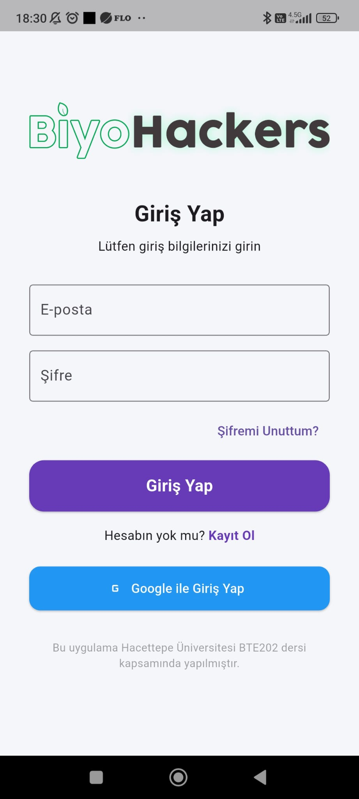
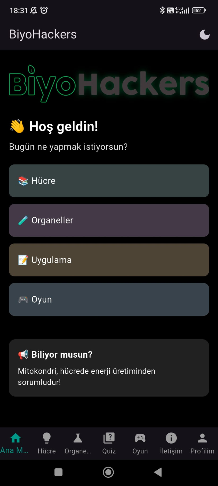
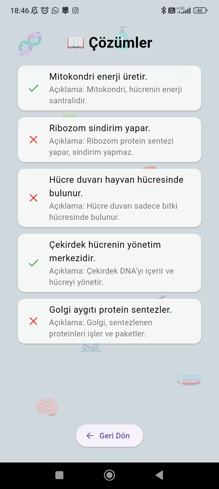

# BiyoHackers

BiyoHackers is an interactive and gamified mobile learning application focused on biology education.  
The app is designed for middle and high school students to learn about cells, organelles, and basic biology through visuals, quizzes, and mini-games.

---

## Features

- Flutter-based mobile application
- Firebase Authentication (Google Sign-In)
- Informative sections about animal and plant cells
- Visual explanation of organelles
- True/False and multiple-choice quizzes
- Gamified “Design Your Own Cell” mode
- Profile page with points and personal info

---

## Screenshots

### ScreenShot 1 - Login Screen


### ScreenShot 2 - Home Menu


### ScreenShot 3 - Contact & Feedback


### ScreenShot 4 - Quiz Page


---

## Technologies Used

| Technology      | Purpose                        |
|----------------|---------------------------------|
| Flutter         | UI development                 |
| Dart            | Programming language           |
| Firebase Auth   | User authentication            |
| Firestore       | Realtime database & storage    |

---

## Getting Started

```bash
git clone https://github.com/celenahmet/biyohackers.git
cd biyohackers
flutter pub get
flutter run

Developer : Ahmet Çelen
Mail : ahmetcelen@hacettepe.edu.tr
Web : https://ahmetcelen.com

---

## 🇹🇷 Türkçe Açıklama

BiyoHackers, biyoloji temelli etkileşimli ve oyunlaştırılmış bir mobil öğrenme uygulamasıdır.  
Uygulama, özellikle ortaokul ve lise öğrencilerinin hücre yapısı, organeller ve temel biyoloji konularını görseller, quizler ve mini oyunlarla öğrenmesini amaçlar.

---

### Özellikler

- Flutter tabanlı mobil uygulama
- Firebase Authentication (Google ile giriş)
- Bitki ve hayvan hücrelerine dair bilgilendirici bölümler
- Organellerin görsel açıklamaları
- Doğru/Yanlış ve Çoktan Seçmeli quizler
- Oyunlaştırılmış “Hücreni Tasarla” modu
- Puan ve kullanıcı bilgilerini gösteren profil sayfası

---

### Ekran Görüntüleri

#### Ekran 1 - Giriş Ekranı


#### Ekran 2 - Ana Menü


#### Ekran 3 - İletişim ve Geri Bildirim


#### Ekran 4 - Quiz Sayfası


---

### Kullanılan Teknolojiler

| Teknoloji       | Kullanım Amacı                     |
|----------------|-------------------------------------|
| Flutter         | Kullanıcı arayüzü geliştirme       |
| Dart            | Uygulama programlama dili          |
| Firebase Auth   | Kullanıcı kimlik doğrulama         |
| Firestore       | Gerçek zamanlı veritabanı ve veri saklama |

---

### Kurulum

```bash
git clone https://github.com/celenahmet/biyohackers.git
cd biyohackers
flutter pub get
flutter run
